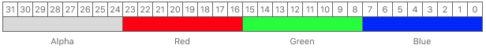
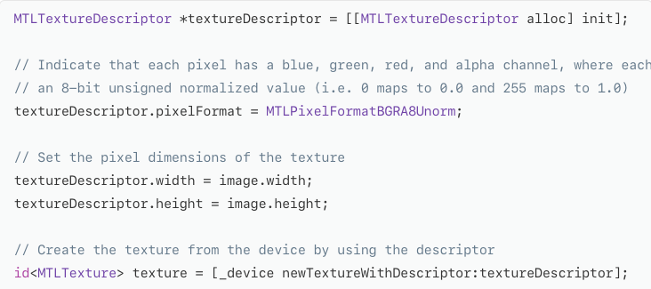

# Creating and Sampling Textures
Load image data into a texture and apply it to a quadrangle

## Overview
A texture is structured collection of texture elements, often called texels or pixels. 
The texture is drawn onto geometric primitives through a process called <b>texture mapping</b>. 
The fragment function generates colors for each fragment by sampling the texture.
  
The Metal framework doesn't provide an API to directly load image data from a file to a texture. 
<b>Metal framework doesn't provide an API to directly load image data from a file to a texture. Metal itself only allocates texture resources and provides methods that copy data to and from the texture.</b>

## Load & Format Image Data
Metal requires all textures to be formatted with a specific *MTLPixelFormat* value 
The pixel format describes the layout of pixel data in the texture. 
For Example *MTLPixelFormatBGRA8Unorn* pixel format, which uses 32 bits per pixel, arranged into 8 bits per component, in blue, green, red, and alpha order 
  
Before you can populate a Metal texture, you must format the image data into the texture's pixel format. 
For Example TGA files can provide pixel data either in a 32-bit-per-pixel format or a 24-bit-per-pixel format.  
Metal will not understand an image with 24-bit BGR format so the pixels are converted to a 32-bit BGRA format. so <b>To convert a 24-bit-per-pixel BGR image, copy the red, green and blue channels and set the alpha channel to 255, indicating a fully opaque pixel</b>

## Create a Texture from a Texture Descriptor
Use a <b>MTLTextureDescriptor</b> object to configure properties like texture and pixel format 
Call the <b>newTextureWithDescriptor:</b> method to create a texture
 
