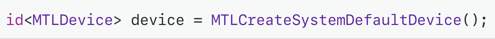

# Performing Calculations on a GPU
Use Metal to find GPUs and perform calculations on them

## Overview
What to learn from this project
- How to convert a simple function written in C to Metal Shading Language(MSL) so that it can be run on a GPU
  - Find GPU, Prepare the MSL function to run on it by creating a pipeline, and create data objects accessible to the GPU
  - To execute the pipeline against your data, create a command buffer, write commands into it, and commit the buffer to a command queue
  - Metal sends the commands to the GPU to be executed

## Write a GPU Function to Perform Calculations
Below is the C Style on the CPU

Each value is calculated independently, so the values can be safely calculated concurrently.
  
To Perform the calculation on the GPU, need to rewrite this function in Metal Shading Language(MSL)
Below is the same function written by Metal. 
In Metal, code that runs on GPUs is called a shader

  
Different of C Style Func and Metal Style Func
- Metal Style Function adds the kernel keyword, which declares that the function is:
  - A public GPU Function. Public functions also can't be called by other shader functions
  - A compute function, which performs a parallel calculation using a grid of threads

Analysis the MSL Function
- device keyword
  - device keyword says that these pointers are in the device address space. Whenever declare a pointer in MSL, you must apply a keyword to declare its address space. Use the device address space to declare persistent memory that the GPU can read from ad write to
- Removes the for-loop
  - function is now going to be called by multiple threads in the compute grid.
- To replace the index previously provided by the for-loop, function takes a new index argument, with another MSL keyword, <b>thread_position_in_grid</b>, specified using C++ attribute syntax
  - "thread_position_in_grid" keyword: Declares that Metal should calculate a unique index for each thread and pass that index in this argument.

## Find a GPU
<b>MTLDevice</b> object is a thin abstraction for a GPU; you use it to communicate with a GPU. Metal creates a MTLDevice for each GPU. To get the default device object, calling <b>MTLCreateSystemDefaultDevice</b>

 

## Initialize Metal Object
