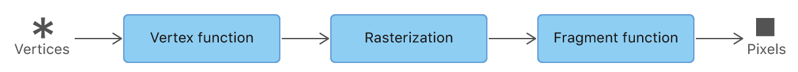

# Using a Render Pipeline to Render Primitives
Render a simple 2D triangle

## Understand the Metal Render Pipeline
A render pipeline processes drawing commands and writes data into a render pass's targets.   
A render pipeline has many stages
- Vertex stage
- Rasterization stage
- Fragment stage

The vertex and fragment stage are programmable, so you write functions for them in Metal Shading Language(MSL) 
The rasterization stage has fixed behavior

Rendering starts with a drawing command, which includes a vertex count and what kind of primitive to render.

## Decide How Data is processed by Your Custom Render Pipeline
A vertex function generates data for a single vertex 
A fragment function generates data for a single fragment 
Below is the 3 typical process
- The inputs to the pipeline, which are provided by your app and passed to the vertex stage
- The outputs of the vertex stage, which is passed to the rasterization stage.
- The inputs to the fragment stage, which are provided by your app or generated by the rasterization stage

