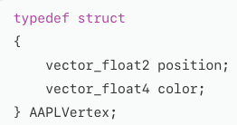
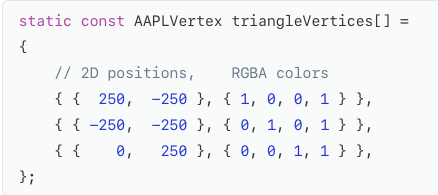
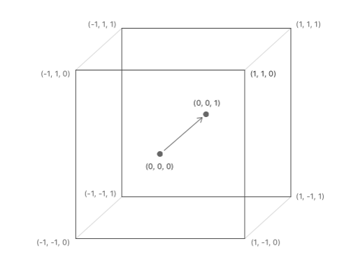
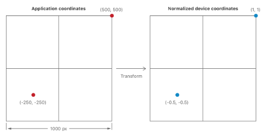
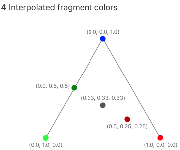
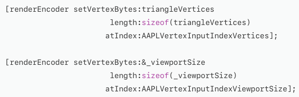
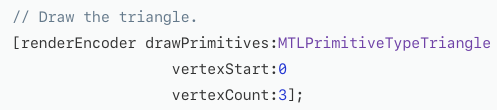

# Using a Render Pipeline to Render Primitives
Render a simple 2D triangle

## Understand the Metal Render Pipeline
A render pipeline processes drawing commands and writes data into a render pass's targets.   
A render pipeline has many stages
- Vertex stage
- Rasterization stage
- Fragment stage

The vertex and fragment stage are programmable, so you write functions for them in Metal Shading Language(MSL) 
The rasterization stage has fixed behavior

Rendering starts with a drawing command, which includes a vertex count and what kind of primitive to render.

## Decide How Data is processed by Your Custom Render Pipeline
A vertex function generates data for a single vertex 
A fragment function generates data for a single fragment 
Below is the 3 typical process
- The inputs to the pipeline, which are provided by your app and passed to the vertex stage
- The outputs of the vertex stage, which is passed to the rasterization stage.
- The inputs to the fragment stage, which are provided by your app or generated by the rasterization stage

Below is the simple vertex structure

Declaring the position as a vector_float2 means it contains two 32-bit float values.(which will hold the x & y coordinates) 
Colors are stored using a vector_float4, so they have four channels-red,green,blue, and alpha.

## Declare the Vertex Function
Declare the vertex function using MSL 
Declare a vertex fuction using the vertex keyword
 
> ''' 
vertex RasterizerData vertexShader( uint vertexID [[vertex_id]], 
             constant AAPLVertex *vertices [[buffer(AAPLVertexInputIndexVertices)]], 
             constant vector_uint2 *viewportSizePointer [[buffer(AAPLVertexInputIndexViewportSize)]]) 
> '''
 
- First argument(vertexID) uses the <b>[[vertex_id]]</b> attribute qualifier, which is another Metal keyword. When execute a render command, the GPU calls vertex function multiple times, generating a unique value for each vertex
- Second argument(vertices) is an array that contains the vertex data, using AAPLVertex struct previously defined
- Third argument(viewportSizePointer), To transform the position into Metal's coordinates, Needs the size of the viewport(in pixels) So these viewport size is stored in the 3rd argument

The second and third arguments have the [[buffer(n)]] attribute qualifier.By default, Metal assigns slots in the argument table for each paramater automatically. 
When you add the [[buffer(n)]] qualifier to a buffer argument, you tell Metal explicitly which slot to use.

## Write the vertex Function
Vertex functions must provide position data in clip-space coordinates, which are 3D points specified using a four-dimensional homogenous vector(x,y,z,w) 
The rasterization stage takes the output position and divides the x,y, and z coordinates by w to generate a 3D point in normalized device coordinates. 
Normalized device coordinates are independent of view port

 
Transform the input coordinate system to the normalized device coordinate system

 
Write a default value to the output coordinate, with the w value is set to 1.0 and the other coordinates set to 0.0. This means that the coordinates are already in the normalized device coordinate space

## Write a Fragment Function
Declare the fragment function using the fragment keyword.
Add the [[stage_in]] attribute qualifier to indicate that this argument is generated by the rasterizer
> ''' 
fragment float4 fragmentShader(RasterizerData in [[stage_in]])
> '''

If your fragment function writes to multiple render targets, it must declare a struct with field for each render target.(This sample only has a single render target)
 
The rasterization stage calculates its color argument as a blend of the colors at the triangle's vertices.

## Create a Render Pipeline State Object
First, get the default library and obtain a MTLFunction object for each function.
>''' 
id<MTLLibrary> defaultLibrary = [_device newDefaultLibrary];  
id<MTLFunction> vertexFunction = [defaultLibrary newFunctionWithName:@"vertexShader"]; 
id<MTLFunction> fragmentFunction = [defaultLibrary newFunctionWithName:@"fragmentShader"]; 
>'''

Create a MTLRenderPipelineState object 
Render pipelines have more stages to configure, use a MTLRenderPipelineDescriptor to configure the pipeline

>'''
MTLRenderPipelineDescriptor *pipelineStateDescriptor = [[MTLRenderPipelineDescriptor alloc] init]; 
pipelineStateDescriptor.label = @"Simple Pipeline"; 
pipelineStateDescriptor.vertexFunction = vertexFunction; 
pipelineStateDescriptor.fragmentFunction = fragmentFunction; 
pipelineStateDescriptor.colorAttachments[0].pixelFormat = mtkView.colorPixelFormat;  
_pipelineState = [_device newRenderPipelineStateWithDescriptor:pipelineStateDescriptor
                                                         error:&error];
>'''

## Set a Viewport
Set the viewport, so that Metal knows which part of the render target you want to draw into
>''' 
[renderEncoder setViewport:(MTLViewport){0.0, 0.0, _viewportSize.x, _viewportSize.y, 0.0, 1.0 }]; 
>'''

## Set the Render Pipeline State
Set the render pipeline state for the pipeline you want to use
>''' 
[renderEncoder setRenderPipelineState:_pipelineState];
 
>'''

## Send Argument Data to the Vertex Function
Often, you use buffers(MTLBuffer) to pass to shaders 
However, when you need to pass only a small amount of data to the vertex function, Copy the data directly into the command buffer  

## Encode the Drawing Command
Specify the kind of primitive, the starting index, and the number of vertices. 
When the triangle is rendered, the vertex function is called with values of 0, 1, and 2 for the vertexID argument
