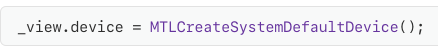
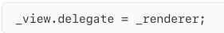
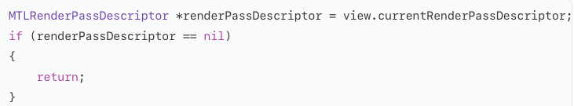

# Rendering setup using Metal

## Prepare a MetalKit View to Draw
MetalKit provides a class called <b>MTKView</b>, which is a subclass of NSView(in macOS) or UIVIew(in iOS and tvOS). MTKView handles many of the details related to getting the content you draw with Metal onto the screen
  
MTKView needs a reference to Metal device object
So First Step is to set the view's device property to an existing MTLDevice. 

## Delegate Drawing Responsibilities
MTKView uses the delegate pattern to inform the app when it should draw. To receive delegate callbacks, set the view's delegate property to an object that conforms to the MTKView Delegate protocol

 
The delegate implements two methods
- mtkView:drawableSizeWillChange:
  - whenever the size of the contents changes. This happens when the window containing the view is resized, or when the device orientation changes
- drawInMTKView
  - Whenever it's time to update the view's contents. when create a command buffer, encode commands that tell the GPU what to draw and when to display it onscreen, and enqueue that command buffer to be executed by the GPU

## Create a Render Pass Descriptor
When draw, the GPU stores the results into textures, which are blocks of memory that contain image data and are accessible to the GPU.  
To draw, should create a render pass, which is a sequence of rendering commands that draw into a set of textures. When used in a render pass, textures are also called render Targets. 
To create a render pass, need a render pass descriptor(<b>MTLRenderPassDescriptor</b>)

 
A render pass descriptor describes the set of render targets, and how they should be processed at the start and end of the render pass

## Create a Render Pass

## Present a Drawable to the Screen
Drawing to a texture doesn't automatically display the new contents onscreen. 
In Metal, textures that can be displayed onscreen are managed by drawable objects
 
MTKView automatically creates drawable objects to manage its textures 
Call the <b>presentDrawable:</b> method on the command buffer, passing in the drawable

## Commit the Command Buffer
[commandBuffer commit];

## Reference
https://developer.apple.com/documentation/metal/basic_tasks_and_concepts/using_metal_to_draw_a_view_s_contents?preferredLanguage=occ