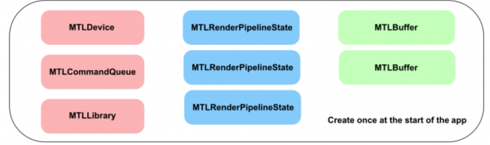
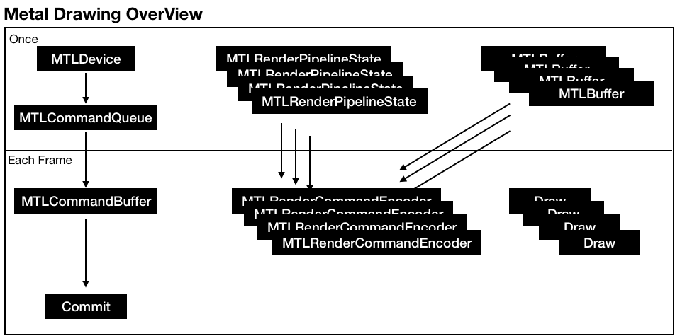
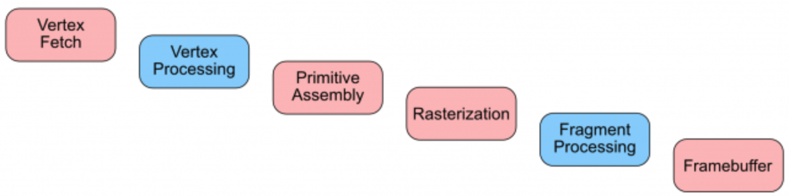

# Metal Rendering Pipeline

## GPU vs CPU

### CPU
A few powerful processors, so It can't handle massive amounts of data really fast but can handle many sequential process tasks(one after another)

### GPU
Multiple less powerful processors, so It can handle massive amounts of data really fast

## Metal Environment Initialization

* MTLDevice : The software reference to the GPU hardware device
* MTLCommandQueue ; Responsible for creating and organizing MTLCommandBuffers each frame
* MTLLibrary : Contains the source code from your vertex & fragment shader functions
* MTLRenderPipelineState : Sets the information for the draw, like which shader functions to use, what depth and color settings to use and how to read the vertex data
* MTLBuffer : Holds data, such as vertex information, in a form what you can send to the GPU

HAVE ONE **MTLDevice**, **MTLCommandQueue**, **MTLLibrary** object to a app  
SEVERAL **MTLRenderPipelineState**(define various pipeline states), **MTLBuffer**(hold the various datas) 

## Metal Drawing OverView

## Rendering Pipeline

